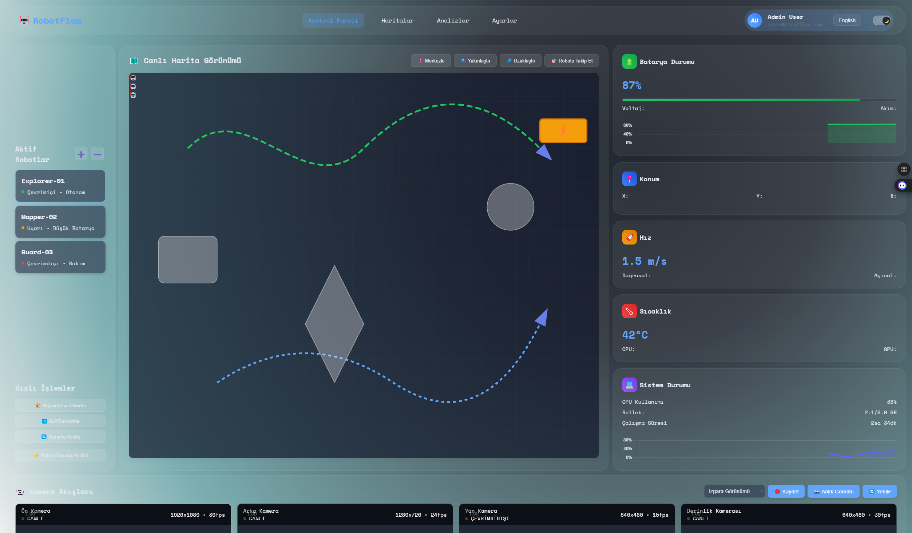

# 🚀 RobotFlow: ROS2 Control Panel (UNDER DEVELOPMENT)

The sleek and functional interface of the RobotFlow Control Panel.

---

[RobotFlow Control Panel](images/banner.png)

---

## 📖 Table of Contents

- [About](#-about)
- [Features](#-features)
- [Demos/Screenshots](#-demos/screenshots)
- [Technologies Used](#-technologies-used)
- [Installation](#-installation)
- [Usage](#-usage)
- [Project Structure](#-project-structure)
- [Contributing](#-contributing)
- [License](#-license)
- [Contact](#-contact)
- [Acknowledgements](#-acknowledgements)

---

## 💡 About

RobotFlow is a modern and interactive web-based control panel designed for mobile robots developed in the ROS2 environment. It is optimized to run seamlessly on platforms like Jetson Orin Nano. This dashboard provides an intuitive interface for visualizing and managing real-time status data (position, velocity, battery, system resources, etc.) of your robots. Our goal is to offer robot operators a comprehensive overview, accelerating decision-making processes and increasing operational efficiency.

---

## ✨ Features

### 📊 Real-time Data Streaming

- Robot's position ($x, y, \theta$ coordinates), linear, and angular velocities.
- Battery status and charge level indicators.
- Real-time monitoring of CPU and memory usage.
- Environmental metrics such as system uptime and temperature.

### ⚙️ Dynamic Robot Management

Ability to easily add new robots to the dashboard and remove existing ones from the list.

### 🎨 Customizable Interface

Arrange dashboard cards (Battery, CPU, Position, etc.) as you wish with drag-and-drop functionality to create your personalized view.

### 💎 Modern Design

A minimalist and eye-catching user interface enhanced with a sleek "Glassmorphism" effect.

### 🌐 Multi-language Support

Caters to a broad user base with Turkish and English language options.

### ☀️🌙 Theme Options

Easy switching between dark and light themes to reduce eye strain and adapt to personal preferences.

### 📈 Detailed Analysis Modals

Interactive graphs based on Chart.js, showing the temporal evolution of critical data such as battery and system performance.

### 📱 Fully Responsive Design

A seamless and optimized experience across all screen sizes, from desktops to tablets and mobile devices.

---

## 📸 Demos/Screenshots

You can add screenshots of your project or a link to a short demo video here.

- Screenshot 1: Main Dashboard View



- Screenshot 2: Analysis Modal Example

[Analysis Modal](images/analysis_modal.png)
*Note: The `analysis_modal.png` image is a placeholder and will be added soon.*

---

## 🛠️ Technologies Used

RobotFlow is developed with the following core technologies:

### Frontend

- HTML5 (Structural Skeleton)
- CSS3 (Styling and Design)
- JavaScript (Interactivity and Dynamic Content)
- [Chart.js](https://www.chartjs.org/) (Charting Library for Data Visualization)
- [Socket.IO](https://socket.io/) (Real-time bi-directional communication)
- [ROSlibjs](http://wiki.ros.org/roslibjs) (ROS library for web applications - necessary for ROS2 integration even if not directly in HTML)

### Backend/Middleware (ROS2 Side)

- ROS2 Humble (Robot Operating System)
- [rosbridge_server](http://wiki.ros.org/rosbridge_server) (Bridge for ROS2 with WebSocket communication)

### Development Environment

- Visual Studio Code
- Git / GitHub

---

## 🚀 Installation

To run the project on your local machine or a ROS2-enabled system (e.g., Jetson Orin Nano), follow these steps:

### 1. Clone the Repository

First, download the project's GitHub repository to your computer:

```bash
git clone https://github.com/omrfrkmll/Robot-DashBoard-for-ROS2.git
cd Robot-DashBoard-for-ROS2
```

### 2. ROS2 Environment and `rosbridge_server` Installation

The dashboard accesses ROS2 data via a WebSocket connection through `rosbridge_server`. Therefore, `rosbridge_server` must be installed and running in your ROS2 environment.

- **ROS2 Humble Installation:** If you don't have ROS2 Humble installed yet, follow the official documentation for installation: [ROS2 Humble Installation Guide](https://docs.ros.org/en/humble/Installation.html)

- **`rosbridge_server` Installation:**

    ```bash
    sudo apt update
    sudo apt install ros-humble-rosbridge-server
    ```

    (You might also need to install the `ros-humble-rosbridge-suite` package for Python3, if applicable.)

- **Starting `rosbridge_server`:**

    ```bash
    ros2 launch rosbridge_server rosbridge_websocket_launch.xml
    ```

    This command will start a WebSocket server, by default at `ws://localhost:9090`. Your dashboard will connect to this address.

### 3. Running the Dashboard

Once `rosbridge_server` is running, simply open the `index.html` file directly in a web browser. You do not need any web server.

---

## 🎮 Usage

When the dashboard loads, it will automatically start processing data from your ROS2 node.

- **Add/Remove Robot:** Use the buttons in the top left corner to manage the robot list.
- **Drag-and-Drop Cards:** You can drag each data card on the dashboard (Battery, CPU, Position, etc.) to rearrange them as desired.
- **Theme Switch:** Toggle between light and dark themes using the theme switch button in the top right corner.
- **Language Switch:** Switch between English and Turkish language options.
- **Analysis Modal:** Click on specific cards (e.g., Battery, CPU) to open modals containing detailed analysis graphs.

---

## 📁 Project Structure

```
RobotFlow/
├── index.html            # Main control panel HTML file
├── css/
│   └── style.css         # Visual styles for the dashboard (themes, layout, etc.)
├── js/
│   └── main.js           # ROS2 communication, data processing, and UI updates
├── images/               # Images used for the project (e.g., banner, logo)
├── LICENSE               # Project's license information
└── README.md             # This document
```

---

## 🤝 Contributing

We welcome contributions to the RobotFlow project! Any contributions will help make the project better. Please follow these steps:

1. Fork the repository.
2. Create a new branch for your feature or bug fix (`git checkout -b feature/AmazingFeature`).
3. Commit your changes (`git commit -m 'Add some AmazingFeature'`).
4. Push to the branch (`git push origin feature/AmazingFeature`).
5. Open a Pull Request.

---

## 📄 License

This project is distributed under the MIT License. See the [LICENSE](LICENSE) file for more details.

---

## 📞 Contact

Your Name - [Your Email Address]
Project Link: [https://github.com/omrfrkmll/Robot-DashBoard-for-ROS2](https://github.com/omrfrkmll/Robot-DashBoard-for-ROS2)

---

## 🙏 Acknowledgements

- To the [Chart.js](https://www.chartjs.org/) team for their excellent charting library.
- To the [Socket.IO](https://socket.io/) team for facilitating real-time communication.
- To the ROS.org and Open Robotics community for the open-source robotics infrastructure.
